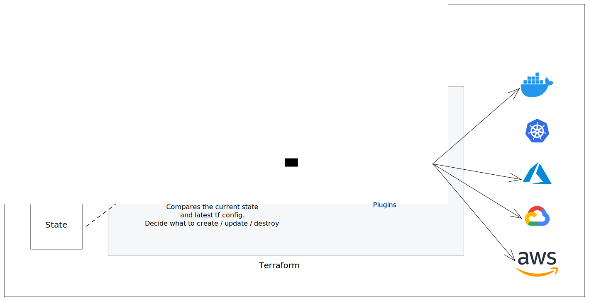
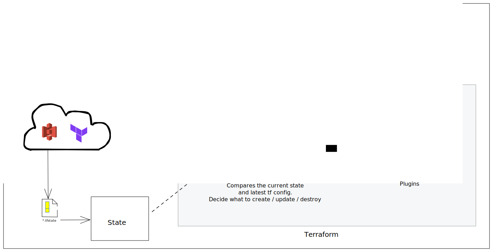

# Terraform

Repository for Terraform modules and examples for managing cloud infrastructures like `Amazon Web Services`, `Azure`, `Google Cloud` and `Oracle Cloud Infrastructure`.

## What is Terraform?

> Terraform allows you to manege your infrastructure, platform and services that run on that platform

HashiCorp Terraform is an infrastructure as code tool that lets you define both cloud and on-prem resources in human-readable configuration files that you can version, reuse, and share. You can then use a consistent workflow to provision and manage all of your infrastructure throughout its lifecycle. Terraform can manage low-level components like compute, storage, and networking resources, as well as high-level components like DNS entries and SaaS features.

Terraform has two components to achieve this:

1. Terraform Core
2. Terraform Plugins

<br />



<br />

## Commands you need to know.

| Command               | Description                                                             |
| --------------------- | ----------------------------------------------------------------------- |
| `terraform init`      | Initialize a working directory containing Terraform configuration files |
| `terraform validate`  | Validates the configuration files in a directory                        |
| `terraform fmt`       | Rewrites configuration files to canonical format                        |
| `terraform plan`      | Generate and show an execution plan                                     |
| `terraform show`      | Inspect Terraform state or plan                                         |
| `terraform apply`     | Builds or changes infrastructure                                        |
| `terraform refresh`   | Updates local state file against real resources                         |
| `terraform destroy`   | Destroy Terraform-managed infrastructure                                |
| `terraform providers` | Prints a tree of the providers used in the configuration                |
| `terraform output`    | Reads an output from a state file                                       |

## Basic Syntax

**Arguments**

The Terraform language syntax is built around two key syntax constructs: arguments and blocks. An argument assigns a value to a particular name:

```hcl
image_id = "abc123"
```

The identifier before the equals sign is the argument name, and the expression after the equals sign is the argument's value.

The context where the argument appears determines what value types are valid (for example, each resource type has a schema that defines the types of its arguments), but many arguments accept arbitrary expressions, which allow the value to either be specified literally or generated from other values programmatically.

> Note: Terraform's configuration language is based on a more general language called HCL, and HCL's documentation usually uses the word "attribute" instead of "argument." These words are similar enough to be interchangeable in this context, and experienced Terraform users might use either term in casual conversation. But because Terraform also interacts with several other things called "attributes" (in particular, Terraform resources have attributes like id that can be referenced from expressions but can't be assigned values in configuration), we've chosen to use "argument" in the Terraform documentation when referring to this syntax construct.

**Blocks**

A block is a container for other content:

```hcl
resource "aws_instance" "example" {
  ami = "abc123"

  network_interface {
    # ...
  }
}
```

A block has a type (resource in this example). Each block type defines how many labels must follow the type keyword. The resource block type expects two labels, which are aws_instance and example in the example above. A particular block type may have any number of required labels, or it may require none as with the nested network_interface block type.

After the block type keyword and any labels, the block body is delimited by the { and } characters. Within the block body, further arguments and blocks may be nested, creating a hierarchy of blocks and their associated arguments.

The Terraform language uses a limited number of top-level block types, which are blocks that can appear outside of any other block in a configuration file. Most of Terraform's features (including resources, input variables, output values, data sources, etc.) are implemented as top-level blocks.

Identifiers
Argument names, block type names, and the names of most Terraform-specific constructs like resources, input variables, etc. are all identifiers.

Identifiers can contain letters, digits, underscores (\_), and hyphens (-). The first character of an identifier must not be a digit, to avoid ambiguity with literal numbers.

For complete identifier rules, Terraform implements the Unicode identifier syntax, extended to include the ASCII hyphen character -.

Comments
The Terraform language supports three different syntaxes for comments:

```hcl
# begins a single-line comment, ending at the end of the line.
```

// also begins a single-line comment, as an alternative to #.
/_ and _/ are start and end delimiters for a comment that might span over multiple lines.
The # single-line comment style is the default comment style and should be used in most cases. Automatic configuration formatting tools may automatically transform // comments into # comments, since the double-slash style is not idiomatic.

Character Encoding and Line Endings
Terraform configuration files must always be UTF-8 encoded. While the delimiters of the language are all ASCII characters, Terraform accepts non-ASCII characters in identifiers, comments, and string values.

Terraform accepts configuration files with either Unix-style line endings (LF only) or Windows-style line endings (CR then LF), but the idiomatic style is to use the Unix convention, and so automatic configuration formatting tools may automatically transform CRLF endings to LF.

Let's take a look at few of the blocks and arguments that we will be using in our examples.

### Providers

Provider block takes in one input label which the name of the provider. The attributes defined in a given terraform provider depends on the provider itself. The following provider block is for Oracle Cloud Infrastructure and requires attributes like `tenancy_ocid`, `user_ocid`, `fingerprint`, `private_key_path` and `region`.

```hcl
# Configure the OCI provider with an API Key
# tenancy_ocid is the compartment OCID for the root compartment
provider "oci" {
  tenancy_ocid = var.tenancy_ocid
  user_ocid = var.user_ocid
  fingerprint = var.fingerprint
  private_key_path = var.private_key_path
  region = var.region
}
```

Sometimes you are targetting more than one provider in your terraform configuration. In that case you can define multiple provider blocks. In this case you can use the `alias` attribute to give a name to the provider. For example if you are targetting both AWS and OCI you can define two provider blocks like the following.

```hcl
# Configure the OCI provider with an API Key
# tenancy_ocid is the compartment OCID for the root compartment
provider "oci" {
  alias = "oci"
  tenancy_ocid = var.tenancy_ocid
  user_ocid = var.user_ocid
  fingerprint = var.fingerprint
  private_key_path = var.private_key_path
  region = var.region
}

# Configure the AWS provider with an API Key
provider "aws" {
  alias = "aws"
  region = var.aws_region
  access_key = var.aws_access_key
  secret_key = var.aws_secret_key
}
```

### Resources

Resource block takes in two input labels. The first is the resource type which will depend on the provider and comes from the provider as well. The second is the resource name which is a user defined name for the resource.

```hcl
resource "aws_instance" "example" {
  ami           = "ami-0c55b159cbfafe1f0"
  instance_type = "t2.micro"
}
```

Some resources have some output that they spit out and are available for other resources to use. For example when you create an instance in AWS it will spit out the public IP address of the instance. You can use that IP address in other resources. You can access the output of a resource using the following syntax.

```hcl
resource "aws_instance" "example" {
  ami           = "ami-0c55b159cbfafe1f0"
  instance_type = "t2.micro"
}

resource "aws_eip" "example" {
  instance = aws_instance.example.id
  vpc      = true
}
```

The second resource depends on the first resource implicitly. You can also explicitly define the dependency using the `depends_on` attribute.

```hcl
resource "aws_instance" "example" {
  ami           = "ami-0c55b159cbfafe1f0"
  instance_type = "t2.micro"
}

resource "aws_eip" "example" {
  instance   = aws_instance.example.id
  vpc        = true
  depends_on = [aws_instance.example]
}
```

### Variables

Terraform supports variables which can be used to parameterize your configuration. Variables are defined in `.tf` files using the `variable` keyword. Variables can be defined in a separate file and imported into the main configuration file. Terraform also supports environment variables. Data types supported by terraform are string, number, boolean, and several complex types such as list, set, map, object, and tuple.

```hcl
variable "region" {
  type = string
  default = "us-east-1"
  description = "AWS region"
}
```

If you want to access the variable you specified use `var.region`. the type attribute specifies explicitly what data type that variable should be. If you don't provide the value for that variable it will prompt you for the value at run time. You can provide a value in the `default` attribute.

Sometimes you want to provider different variables for different environments. For example let's say you want the region for stagging environment to be `us-east-2` and for production you want to use `us-east-1`. You can do that by creating a file called `stagging.tfvars` and `prod.tfvars` and specify the values for the variables in those files.

```hcl
# stagging.tfvars
region = "us-east-2"
```

```hcl
# production.tfvars
region = "us-east-1
```

Then you can run the following command to use those variables.

```bash
# For stagging
terraform apply -var-file="stagging.tfvars"

# For production
terraform apply -var-file="prod.tfvars"
```

### Data Sources

```hcl
data "aws_ami" "example" {
  most_recent = true

  filter {
    name   = "name"
    values = ["amzn-ami-hvm-*"]
  }

  filter {
    name   = "owner-alias"
    values = ["amazon"]
  }

  owners = ["amazon"]
}
```

### Outputs

As we have seen above some resources output some values. You can also define your own outputs. Outputs are defined in `.tf` files using the `output` keyword. You can access the output of a resource using the following syntax.

```hcl
output "instance_ip_addr" {
  value = aws_instance.example.public_ip
}
```

In the cli you will see `instance_ip_addr` as the output of the resource. You can also access the outputs you defined using `terraform output` command.

```bash
terraform output instance_ip_addr
```

## File structure

When you run the cli, terraform takes all the `.tf` files in the directory and concatenates them together. That means your tf file organization doesn't matter that much from execution standpoint. There are some best practices you should follow to break up your terraform files into logical groups.

```bash
.
├── main.tf
├── outputs.tf
├── variables.tf
└── README.md
```

## Terraform Modules

Terraform modules are reusable components that can be used across different Terraform configurations. Modules are used to create reusable components in Terraform and are simply a set of Terraform files in a folder.

### Module Structure

A module is a collection of `.tf` files in a directory. When this directory is used as a root module, Terraform will automatically infer the source from the local filesystem.

```bash
.
├── main.tf
├── outputs.tf
├── variables.tf
└── README.md
```

### Module Sources

Terraform modules can be sourced from local filesystem paths, from public or private Terraform Registry module registries, or from any version control system supported by Terraform, including GitHub, GitLab, Bitbucket, and generic Git or Mercurial repositories.

### Module Registry

The Terraform Registry is a public index of modules published directly from their original source code repositories. The Registry is open-source, and anyone can publish a module. The Registry is integrated directly into Terraform, and you can use it automatically from any Terraform configuration by simply specifying a registry source address in the `source` argument of a `module` block.

## Terraform state

Terraform state is used to map resources to configuration. Terraform state is stored in a file named `terraform.tfstate`. Terraform state is used by Terraform to map real world resources to your configuration. When you run `terraform apply` for the first time the state file will be created. Each time you run any terraform command w ill compare the state file with the configuration and determine what changes need to be made to the real world resources to make them match the configuration. After comparing when you run `terraform apply` the state file will be updated. Sometimes there are many infrastructures to track and getting state of each resources can be time consuming. In those kind of scenarior you can run `terraform plan -refresh=false` to skip the state refresh.

When collaborating with other developers, Terraform state should be stored remotely so that everyone on the team can access it. Terraform supports remote state storage using the following backends:

- Terraform Cloud
- Amazon S3
- Azure Blob Storage
- Google Cloud Storage

<br />



<br />

Here is a code snippet that srores the state file in s3 bucket

```hcl
terraform {
  bucket = "<terraform-bucket-name>"
  key = "<terraform-state-file-directory-on-s3>"
  region = "<aws-region>"
}
```

If your storing your state file remotely you need to make sure you are in sync with the remote state, For that terraform provides a comand you can use:

```bash
terraform state pull
```

**Sensitive Data in State**

Terraform state can contain sensitive data, depending on the resources in use and your definition of "sensitive." The state contains resource IDs and all resource attributes. For resources such as databases, this may contain initial passwords.
When using local state, state is stored in plain-text JSON files.

When using remote state, state is only ever held in memory when used by Terraform. It may be encrypted at rest, but this depends on the specific remote state backend.

**Recommendations**
If you manage any sensitive data with Terraform (like database passwords, user passwords, or private keys), treat the state itself as sensitive data. Storing state remotely can provide better security. As of Terraform 0.9, Terraform does not persist state to the local disk when remote state is in use, and some backends can be configured to encrypt the state data at rest.

For example:

- Terraform Cloud always encrypts state at rest and protects it with TLS in transit. Terraform Cloud also knows the identity of the user requesting state and maintains a history of state changes. This can be used to control access and track activity.
- The S3 backend supports encryption at rest when the encrypt option is enabled. IAM policies and logging can be used to identify any invalid access. Requests for the state go over a TLS connection.

## Best practices

### State and statefile best practices

1. Don't manually manipulate the state file. Use the terraform commands to manipulate the state file.
2. Use remote state storage for collaboration.
3. To avoid a scenario where two developers are changing the same resource at the same time, use a locking mechanism (State locking). Terraform Cloud provides a locking mechanism out of the box. S3 also supports state locking using DynamoDB. NOTE: Not all storage solutions provide this functionality.
4. Backup your state file or better yet, use versioning. S3 has this feature so you can enable it.
5. Usually you will have multiple deployment environments to manage thus multiple state files. Use 1 state file per environment and remote state storage solution.
6.

### Terraform configuration best practices

1. Use version control for your Terraform configurations in a dedicated repository.
2. Setup a mechanisim for IaC code review and automated tests.
3. Automate CD process using CI/CD tools rather than manually running terraform commands.
